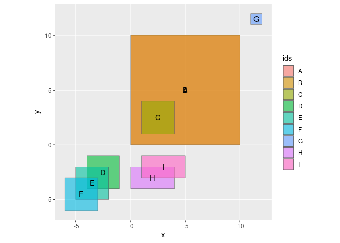

# R script to check overlap of polygons

This script compute the dyadic (1-1) overlap of polygons among a given collection with `ovr_get_overlap_pairs`. It returns a data frame where each row is an overlapping dyad A-B, with respective areas and percentage of overlap with respect to A and B. 

Function `ovr_add_group()`  uses `igraph` tools to indicate groups of overlapping polygons int eh output from `ovr_get_overlap_pairs`. 

## Functions description:

- `ovr_get_overlap_pairs()`:
  - @param `sf` the sf object
  - @param `id_var` optional variable containing the row identifier
  - @param `unit` the unit in which to report the area
  - @param `pre_filter` whether to run first `st_intersects` to filter? Recommended as seems always
  faster...
  - @param `inter_make_valid` whether to repair potentially invalid values
  - @returns a tibble where each row represents an overlapping A-B dyad,  and columns indicate the id of the dyad, the area of each polygon, their interscetion and  percentage of overlap
- `ovr_add_group()`:
  - @param df_inter the output from `ovr_get_overlap_pairs`

## demo


Load code:

```r
source("https://raw.githubusercontent.com/MatthieuStigler/Misc/master/spatial/check_overlap/check_overlap.R")
```


Create demo data


```r
library(sf)
```

```
## Linking to GEOS 3.10.2, GDAL 3.4.3, PROJ 8.2.0; sf_use_s2() is TRUE
```

```r
library(ggplot2)
library(dplyr, warn.conflicts = FALSE)
  
M1 = matrix(c(0,0,10,0,10,10,0,10,0,0),ncol=2, byrow=TRUE)
M2 <- M1+0.01
M3 = matrix(c(1,1,1,4,4,4,4,1,1,1),ncol=2, byrow=TRUE)
M4 <- M3-5
M5 <- M3-6
M6 <- M3-7
M7 = matrix(c(11,11,11,12,12,12,12,11,11,11),ncol=2, byrow=TRUE)
M8 = matrix(c(0,-2,4,-2,4,-4,0,-4,0,-2),ncol=2, byrow=TRUE)
M9 <- M8+1

M_all <- list(M1, M2, M3, M4, M5, M6, M7, M8, M9)
pl2 = purrr::map(M_all, ~st_polygon(list(.)))
FC <- st_sf(ids = LETTERS[1:length(pl2)], geometry=st_sfc(pl2), x=rnorm(length(pl2)))
```

Plot the demo data:


```r
ggplot(data = FC) +
  geom_sf(aes(fill = ids), alpha = 0.6) +
  geom_sf_text(aes(label = ids))
```

<!-- -->

Use now the function:


```r
ovr_get_overlap_pairs(sf=FC)
```

```
## # A tibble: 7 × 8
##   dyad  row_A row_B area_inter area_A area_B area_A_overlapped area_B_overlapped
##   <chr> <int> <int>      [m^2]  [m^2]  [m^2]             <dbl>             <dbl>
## 1 1 2       1     2       99.8    100    100              99.8              99.8
## 2 1 3       1     3        9      100      9               9               100  
## 3 2 3       2     3        9      100      9               9               100  
## 4 4 5       4     5        4        9      9              44.4              44.4
## 5 4 6       4     6        1        9      9              11.1              11.1
## 6 5 6       5     6        4        9      9              44.4              44.4
## 7 7 8       7     8        3        8      8              37.5              37.5
```

Add groups:


```r
ovr_get_overlap_pairs(sf=FC) %>% 
  ovr_add_group()
```

```
## # A tibble: 7 × 10
##   dyad  group group_N row_A row_B area_inter area_A area_B area_A_overlapped
##   <chr> <chr>   <dbl> <int> <int>      [m^2]  [m^2]  [m^2]             <dbl>
## 1 1 2   1 2 3       3     1     2       99.8    100    100              99.8
## 2 1 3   1 2 3       3     1     3        9      100      9               9  
## 3 2 3   1 2 3       3     2     3        9      100      9               9  
## 4 4 5   4 5 6       3     4     5        4        9      9              44.4
## 5 4 6   4 5 6       3     4     6        1        9      9              11.1
## 6 5 6   4 5 6       3     5     6        4        9      9              44.4
## 7 7 8   7 8         2     7     8        3        8      8              37.5
## # ℹ 1 more variable: area_B_overlapped <dbl>
```

Optional: specifiy polygons id variable


```r
ovr_get_overlap_pairs(sf=FC, id_var =ids)
```

```
## # A tibble: 7 × 8
##   dyad  row_A row_B area_inter area_A area_B area_A_overlapped area_B_overlapped
##   <chr> <chr> <chr>      [m^2]  [m^2]  [m^2]             <dbl>             <dbl>
## 1 A B   A     B           99.8    100    100              99.8              99.8
## 2 A C   A     C            9      100      9               9               100  
## 3 B C   B     C            9      100      9               9               100  
## 4 D E   D     E            4        9      9              44.4              44.4
## 5 D F   D     F            1        9      9              11.1              11.1
## 6 E F   E     F            4        9      9              44.4              44.4
## 7 H I   H     I            3        8      8              37.5              37.5
```

Optional: run a first filter with `st_intersects`. In some cases where only a few features are overlapping, I found this to be faster. 


```r
all.equal(ovr_get_overlap_pairs(sf=FC, pre_filter = TRUE, id_var =ids) |> arrange(row_A, row_B),
          ovr_get_overlap_pairs(sf=FC, pre_filter = FALSE, id_var =ids)|> arrange(row_A, row_B))
```

```
## [1] TRUE
```


