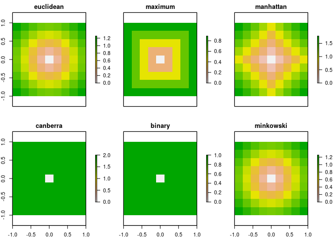
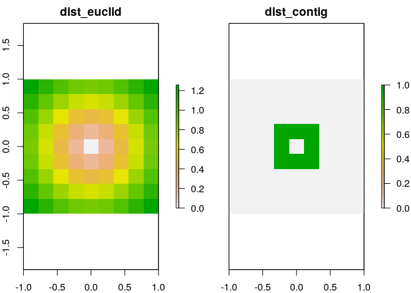
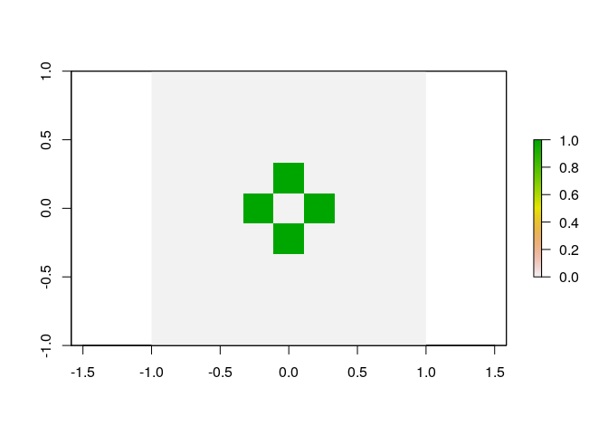
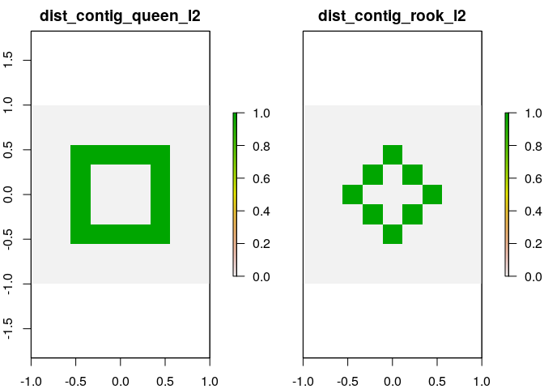
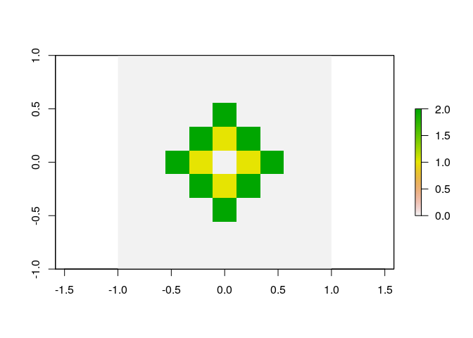
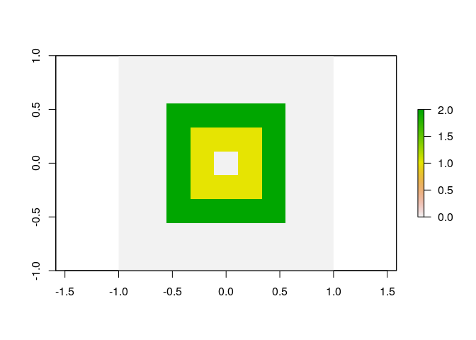
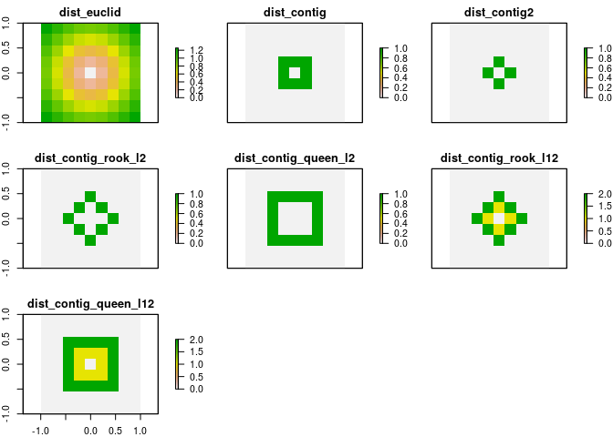

-   [Data setup](#data-setup)
    -   [Extract cell coordinates:](#extract-cell-coordinates)
    -   [Distance using dist() on cells
        coordinates](#distance-using-dist-on-cells-coordinates)
    -   [contiguous distance](#contiguous-distance)
    -   [contiguous: No queen](#contiguous-no-queen)
    -   [Contiguous level 2](#contiguous-level-2)
    -   [Contiguous level 1 and 2](#contiguous-level-1-and-2)
-   [Show all](#show-all)

I wanted to check how to compute distances between cells ina raster.
There is the function `raster::distance()`, but it does not seem to be
doing quite what I want. So I ended up using `rasterToPolygons()`, and
either taking standard distances from the centroids, or using spatial
distances found in package `spdep`.

Data setup
----------

    library(raster)
    library(spdep)
    library(tidyverse)
    library(magrittr)

Make a very simple raster

    r <- raster(nrows = 9, ncols = 9, xmn=-1, xmx=1, ymn=-1, ymx=1)
    # r[] <-  sample(1:81, size = 81, replace = FALSE)

### Extract cell coordinates:

    ## Method 1
    xyFromCell(r, cell = 1:ncell(r)) %>%  head

    ##               x         y
    ## [1,] -0.8888889 0.8888889
    ## [2,] -0.6666667 0.8888889
    ## [3,] -0.4444444 0.8888889
    ## [4,] -0.2222222 0.8888889
    ## [5,]  0.0000000 0.8888889
    ## [6,]  0.2222222 0.8888889

    ## Method 2
    rasterToPolygons(r) %>%  
      coordinates %>% 
      head

    ##         [,1]      [,2]
    ## 1 -0.8888889 0.8888889
    ## 2 -0.6666667 0.8888889
    ## 3 -0.4444444 0.8888889
    ## 4 -0.2222222 0.8888889
    ## 5  0.0000000 0.8888889
    ## 6  0.2222222 0.8888889

### Distance using dist() on cells coordinates

    dist_rast <-  function(x, method = "euclidean")  {
      x %>% 
       xyFromCell(cell = 1:ncell(.)) %>% 
        dist(method = method) 
    }

    r_new <- data_frame(dist = c("euclidean", "maximum", "manhattan", "canberra", "binary", "minkowski")) %>% 
      mutate(dist_dat =map(dist, ~ {r[] <- dist_rast(r, method = .) %>%  as.matrix() %>% .[41,]; names(r) <- .; r}) )  %$%
      stack(dist_dat)
    plot(r_new)

Keep euclidean for later comparison:

    r$dist_euclid <- dist_rast(r) %>%  as.matrix() %>% .[41,]

### contiguous distance

    r$dist_contig <- rasterToPolygons(r)  %>% 
      poly2nb() %>% 
      nb2mat(style = "B") %>%  .[41,]
    plot(r)

### contiguous: No queen

    r$dist_contig2 <- rasterToPolygons(r)  %>% 
      poly2nb(queen = FALSE) %>% 
      nb2mat(style = "B") %>%  .[41,]
    plot(r$dist_contig2)

### Contiguous level 2

    r$dist_contig_rook_l2 <- rasterToPolygons(r)  %>% 
      poly2nb(queen = FALSE) %>% 
      nblag(maxlag=2) %>%  .[[2]] %>% 
      nb2mat(style = "B") %>%  . [41,]

    r$dist_contig_queen_l2 <- rasterToPolygons(r)  %>% 
      poly2nb(queen = TRUE) %>% 
      nblag(maxlag=2) %>%  .[[2]] %>% 
      nb2mat(style = "B") %>%  . [41,]

    plot(r[[c("dist_contig_queen_l2", "dist_contig_rook_l2")]])

### Contiguous level 1 and 2

    cont_rook_lags <- rasterToPolygons(r)  %>% 
      poly2nb(queen = FALSE) %>% 
      nblag(maxlag=2) %>% 
      map(nb2mat, style = "B") 
    cont_rook_l12 <- cont_rook_lags[[1]] + cont_rook_lags[[2]]*2
    r$dist_contig_rook_l12 <- cont_rook_l12[41,]
    plot(r$dist_contig_rook_l12)

    cont_queen_lags <- rasterToPolygons(r)  %>% 
      poly2nb(queen = TRUE) %>% 
      nblag(maxlag=2) %>% 
      map(nb2mat, style = "B") %>%  
      map2(list(1, 2), ~.x *.y ) %>% 
      {Reduce('+', .)}

    r$dist_contig_queen_l12 <- cont_queen_lags[41,]
    plot(r$dist_contig_queen_l12)

Show all
--------

    plot(r)

