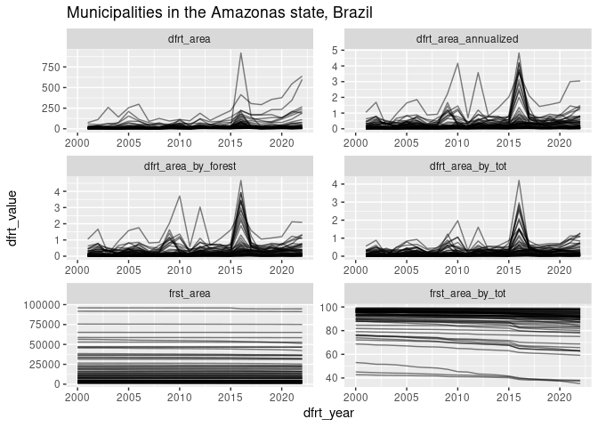

# Introduction: Forest cover change scripts 

A collection of R scripts to process forest cover data from Hansen or PRODES.

Use with:


```r
source("https://raw.githubusercontent.com/MatthieuStigler/Misc/master/spatial/forest_cover_change/frst_forest_cover_change_scripts.R")
```

# Output variables names

- `dfrt_year` year
- `dfrt_any` unit level: was there any observed deforestation for this unit over the whole sample?

Deforestation variables:

- `dfrt_area`: raw deforestation area
- `dfrt_area_by_tot`: deforestation area by unit area (%)
- `dfrt_area_by_forest`: deforestation area by initial forest area (%)
- `dfrt_area_annualized`: deforestation area by previous year's forest area (%)

Forest cover variables:

- `frst_area`: raw forest cover
- `frst_area_by_tot`: forest cover by unit area (%)


# Conventions:

When initial forest ==0:

 - the `dfrt_area_*` variables will be NA
 
When initial forest >0 but there is no deforestation:

- The output of `frst_HAN_process` will contain `dfrt_year` of `NA` (to make sure the observations appears once), but will have `dfrt_area_*` of 0
- The output of `frst_dfrt_complete` will contain `dfrt_year` with same years as other units
    
 

# Functions

- `frst_HAN_process`: main function
- `frst_dfrt_complete`: add years without deforestation
- `frst_HAN_add_frst_cover`: add forest cover


Check output:

- `frst_HAN_check_final`: main test
- `frst_add_forest_check`:


# Example


## Example 1: data does NOT contain unit's area


```r
library(tidyverse, warn.conflicts = FALSE)
source("https://raw.githubusercontent.com/MatthieuStigler/Misc/master/spatial/forest_cover_change/frst_forest_cover_change_scripts.R")

df_test_Han <- tibble(cell_id=rep(c("Normal", "No def", "Full def"), c(3,1, 1)),
                        lossyear = as.integer(c(0,2,3, 0, 5)),
                        area = 10000) %>%   
    group_by(cell_id) %>%
    mutate(area_total = sum(area)) %>%
    ungroup()
knitr::kable(df_test_Han)
```


|cell_id  | lossyear|  area| area_total|
|:--------|--------:|-----:|----------:|
|Normal   |        0| 10000|      30000|
|Normal   |        2| 10000|      30000|
|Normal   |        3| 10000|      30000|
|No def   |        0| 10000|      10000|
|Full def |        5| 10000|      10000|


```r
df_test_Han_prep <- df_test_Han %>% 
    frst_HAN_process(recompute_forest=TRUE) %>% 
    frst_dfrt_complete(nest_vars=nesting(cell_id, area_forest_initial, dfrt_any, area_total, area_forest_final),
                      years_all=2000:2005) 
df_test_Han_prep
```

```
## # A tibble: 18 × 9
##    cell_id  area_forest_initial dfrt_any area_total area_forest_final dfrt_year
##    <chr>                  <dbl> <lgl>         <dbl>             <dbl>     <int>
##  1 Full def               10000 TRUE          10000                 0      2000
##  2 Full def               10000 TRUE          10000                 0      2001
##  3 Full def               10000 TRUE          10000                 0      2002
##  4 Full def               10000 TRUE          10000                 0      2003
##  5 Full def               10000 TRUE          10000                 0      2004
##  6 Full def               10000 TRUE          10000                 0      2005
##  7 No def                 10000 FALSE         10000             10000      2000
##  8 No def                 10000 FALSE         10000             10000      2001
##  9 No def                 10000 FALSE         10000             10000      2002
## 10 No def                 10000 FALSE         10000             10000      2003
## 11 No def                 10000 FALSE         10000             10000      2004
## 12 No def                 10000 FALSE         10000             10000      2005
## 13 Normal                 30000 TRUE          30000             10000      2000
## 14 Normal                 30000 TRUE          30000             10000      2001
## 15 Normal                 30000 TRUE          30000             10000      2002
## 16 Normal                 30000 TRUE          30000             10000      2003
## 17 Normal                 30000 TRUE          30000             10000      2004
## 18 Normal                 30000 TRUE          30000             10000      2005
## # ℹ 3 more variables: dfrt_area <dbl>, dfrt_area_by_tot <dbl>,
## #   dfrt_area_by_forest <dbl>
```


## Example 2: data contains unit's area


```r
df_test_Han_2 <- tibble(cell_id=rep(c("Normal", "Zero def", "No deforestable", "some def"), c(3,1, 1,1)),
                          lossyear = as.integer(c(0,2,3,0,NA,5)),
                          area = 10000) %>%   
    group_by(cell_id) %>%
    mutate(area_total = sum(area)) %>%
    ungroup() %>% 
    mutate(area_forest_initial = if_else(is.na(lossyear), 0, area_total))

knitr::kable(df_test_Han_2)
```


|cell_id         | lossyear|  area| area_total| area_forest_initial|
|:---------------|--------:|-----:|----------:|-------------------:|
|Normal          |        0| 10000|      30000|               30000|
|Normal          |        2| 10000|      30000|               30000|
|Normal          |        3| 10000|      30000|               30000|
|Zero def        |        0| 10000|      10000|               10000|
|No deforestable |       NA| 10000|      10000|                   0|
|some def        |        5| 10000|      10000|               10000|


```r
df_test_Han_prep_2 <- df_test_Han_2 %>% 
    frst_HAN_process(area_mask_forest_var = area_forest_initial) %>% 
    frst_dfrt_complete(nest_vars=nesting(cell_id, area_forest_initial, dfrt_any, area_total, area_forest_final),
                      years_all=2000:2005) 
df_test_Han_prep_2 %>% select(cell_id, area_total, area_forest_initial, dfrt_any, dfrt_year, dfrt_area)
```

```
## # A tibble: 24 × 6
##    cell_id         area_total area_forest_initial dfrt_any dfrt_year dfrt_area
##    <chr>                <dbl>               <dbl> <lgl>        <int>     <dbl>
##  1 No deforestable      10000                   0 FALSE         2000        NA
##  2 No deforestable      10000                   0 FALSE         2001        NA
##  3 No deforestable      10000                   0 FALSE         2002        NA
##  4 No deforestable      10000                   0 FALSE         2003        NA
##  5 No deforestable      10000                   0 FALSE         2004        NA
##  6 No deforestable      10000                   0 FALSE         2005        NA
##  7 Normal               30000               30000 TRUE          2000         0
##  8 Normal               30000               30000 TRUE          2001         0
##  9 Normal               30000               30000 TRUE          2002     10000
## 10 Normal               30000               30000 TRUE          2003     10000
## # ℹ 14 more rows
```

## Example 3: Hansen data in the Amazonas

Data was process with rgee and is stored on:


```r
hansen_Amaz_demo <- read_csv("https://raw.githubusercontent.com/MatthieuStigler/Misc/master/spatial/forest_cover_change/hansen_raw_amazonas_BRA_from_rgee.csv",
                             show_col_types = FALSE)
```

Do full processing:


```r
hansen_Amaz_demo_clean <- hansen_Amaz_demo %>% 
  frst_HAN_process(area_mask_forest_var = mask_hansen, full_area_var = area_ee, area =sum,
                   .group_vars = c(ADM0_NAME, ADM1_NAME, ADM2_CODE, ADM2_NAME)) %>% 
  frst_dfrt_complete(nest_vars=nesting(ADM0_NAME, ADM1_NAME, ADM2_CODE, ADM2_NAME, 
                                       area_forest_initial, dfrt_any, area_total, area_forest_final)) %>% 
  frst_add_forest(.group_vars = ADM2_NAME, add_first_year = TRUE) %>% 
  frst_add_dfrt_annualized(.group_vars = ADM2_NAME)
```

Check the data, need to use a rather low tolerance to get all tests to pass:


```r
hansen_Amaz_demo_clean %>% 
  frst_HAN_check_final(.group_vars = ADM2_NAME, tol = 1e-6, has_forest_cover_0_year = TRUE)
```

```
## Test 1: no unexpected NAs
## 	Passed! 🎉
## Test 2: area_final = area_initial - sum(dfrt_area)
## 	Passed! 🎉
## Test 3 A: No NA values if dfrt_any
## 	Passed! 🎉
## Test 3 B: if forest_initial =0 THEN NA dfrt_area_*
## 	Passed! 🎉
## Test 4: area_* vars are unique at .group_vars level
## 	Passed! 🎉
## Test 5: dfrt_area_by_* is correct
## 	Passed! 🎉
## Test 6: final forest cover: using frst_add_forest_check()
## 	Passed! 🎉
## Test 7: dfrt_any==FALSE <=> area_forest_initial==area_forest_final  
## 	Passed! 🎉
```

Plot: turn to long and plot:


```r
hansen_Amaz_demo_clean %>% 
  gather(dfrt_var, dfrt_value, starts_with(c("dfrt_area", "frst_area"))) %>% 
  ggplot(aes(x=dfrt_year, y= dfrt_value, group= ADM2_NAME))+
  geom_line(alpha=0.5)+
  facet_wrap(~dfrt_var, scales="free", ncol=2)+
  ggtitle("Municipalities in the Amazonas state, Brazil")
```

```
## Warning: Removed 62 rows containing missing values (`geom_line()`).
```

<!-- -->

