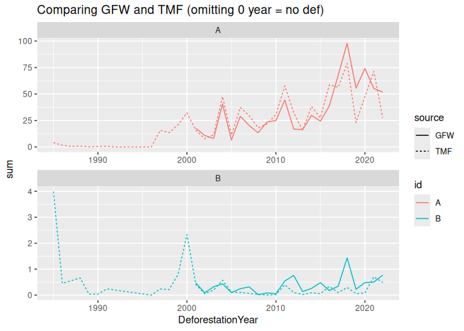

# Code to get hansen data with rgee

This code simplifies the procedure to get Hansen forest loss data, including an initial step to mask pixels using the `treecover2000` raster layer. 

## Demo

Source script:


```r
devtools::source_url("https://raw.githubusercontent.com/MatthieuStigler/Misc/master/spatial/rgee/rgee_hansen_forest/eegfw_get_hansen.R")
```

```
## ℹ SHA-1 hash of file is "436ad9af96ca9bcb2e926434db84689738b260ce"
```

Load libraries, authenticate:


```r
library(dplyr, warn.conflicts = FALSE)
library(sf)
```

```
## Linking to GEOS 3.10.2, GDAL 3.4.3, PROJ 8.2.0; sf_use_s2() is TRUE
```

```r
library(rgee)

ee_Initialize(user = "XXX", gcs = FALSE)
```

```
## ── rgee 1.1.7 ─────────────────────────────────────── earthengine-api 0.1.358 ── 
##  ✔ user: XXX
##  ✔ Initializing Google Earth Engine:
 ✔ Initializing Google Earth Engine:  DONE!
## 
 ✔ Earth Engine account: XXX
## 
 ✔ Python Path: XXX
## ────────────────────────────────────────────────────────────────────────────────
```

```r
## set to `gcs = TRUE` if you want to export after with ee_table_to_gcs()
```

Create pseudo input polygons:


```r
geom_1 <- ee$Geometry$Polygon(list(list(c(-73.83, 2.43) ,c(-73.83, 2.02),
                                        c(-73.14, 2.02),c(-73.14, 2.43))))
geom_2 <- ee$Geometry$Polygon(list(list(c(-73.72, 1.86) ,c(-73.72, 1.54),
                                        c(-72.88, 1.54), c(-72.88, 1.86))))
FC = ee$FeatureCollection(list(ee$Feature(geom_1, list(id="A")),
                               ee$Feature(geom_2, list(id="B"))))
ee_as_sf(FC)
```

```
## Registered S3 method overwritten by 'geojsonsf':
##   method        from   
##   print.geojson geojson
```

```
## Simple feature collection with 2 features and 1 field
## Geometry type: POLYGON
## Dimension:     XY
## Bounding box:  xmin: -73.83 ymin: 1.54 xmax: -72.88 ymax: 2.43
## Geodetic CRS:  WGS 84
##   id                       geometry
## 1  A POLYGON ((-73.83 2.02, -73....
## 2  B POLYGON ((-73.72 1.54, -72....
```


### Run without mask:


```r
out_EE <- eegfw_get_dfrt(FC = FC)
GFW_masked_unmasked <- eegfw_quick_process(ee=out_EE)
GFW_masked_unmasked
```

```
## # A tibble: 44 × 5
##    area_ee id    losstotal lossyear   sum
##      <dbl> <chr>     <dbl>    <int> <dbl>
##  1   3480. A          935.        1 22.4 
##  2   3480. A          935.        2 13.5 
##  3   3480. A          935.        3  9.84
##  4   3480. A          935.        4 52.1 
##  5   3480. A          935.        5  8.40
##  6   3480. A          935.        6 37.7 
##  7   3480. A          935.        7 25.6 
##  8   3480. A          935.        8 16.9 
##  9   3480. A          935.        9 29.0 
## 10   3480. A          935.       10 30.2 
## # ℹ 34 more rows
```

## Run with mask


```r
mask_90 <- eegfw_get_mask()
out_mask_EE <- eegfw_get_dfrt(FC = FC, mask =mask_90)
GFW_masked <- eegfw_quick_process(ee=out_mask_EE)
GFW_masked
```

```
## # A tibble: 46 × 6
##    area_ee id    losstotal mask_hansen lossyear     sum
##      <dbl> <chr>     <dbl>       <dbl>    <int>   <dbl>
##  1   2994. A          767.       2525.        0 1758.  
##  2   2994. A          767.       2525.        1   17.6 
##  3   2994. A          767.       2525.        2   10.8 
##  4   2994. A          767.       2525.        3    7.98
##  5   2994. A          767.       2525.        4   40.6 
##  6   2994. A          767.       2525.        5    6.49
##  7   2994. A          767.       2525.        6   28.9 
##  8   2994. A          767.       2525.        7   20.2 
##  9   2994. A          767.       2525.        8   13.4 
## 10   2994. A          767.       2525.        9   23.6 
## # ℹ 36 more rows
```


## Use TMF instead

To use the TMF product, use:


```r
TMF_v2022 <- eegfw_quick_process(ee=eeTMF_get_dfrt(FC = FC))
TMF_v2021 <- eegfw_quick_process(ee=eeTMF_get_dfrt(FC = FC, version='projects/JRC/TMF/v1_2021/DeforestationYear'))
```

## combine results and plot


```r
GFW_TMF <- rbind(TMF_v2022 %>% 
                   mutate(source= "TMF"),
                 GFW_masked %>% 
                   select(area_ee, id, DeforestationYear=lossyear, sum) %>% 
                   mutate(source = "GFW",
                          DeforestationYear=if_else(DeforestationYear==0, 0, DeforestationYear+2000)))

library(ggplot2)
GFW_TMF %>% 
  filter(DeforestationYear!=0) %>% 
  ggplot(aes(x=DeforestationYear, y=sum, color=id, linetype=source))+
  geom_line()+
  facet_wrap(~id, scales="free", ncol=1)+
  ggtitle("Comparing GFW and TMF (omitting 0 year = no def)")
```

<!-- -->

## Export task

Eventually, export task using `rgee::ee_table_to_drive()` for google drive or `rgee::ee_table_to_gcs()` for google cloud storage. For the latter, make sure you initialized `ee_Initialize(user = "XXX", gcs = TRUE)` with `gcs = TRUE`. 

Example with `ee_table_to_gcs()`:


```r
## Try export
ee_table_to_gcs(
  collection=coll_out,
  description = desc,
  bucket = ,###,
  fileNamePrefix = name,
  timePrefix = FALSE,
  fileFormat = "geojson")
```

