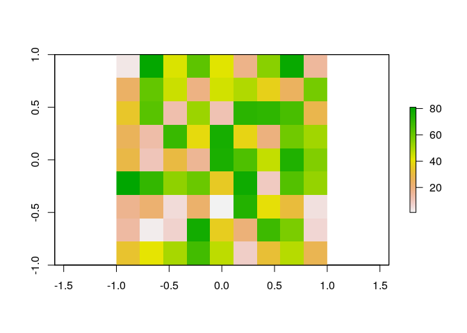
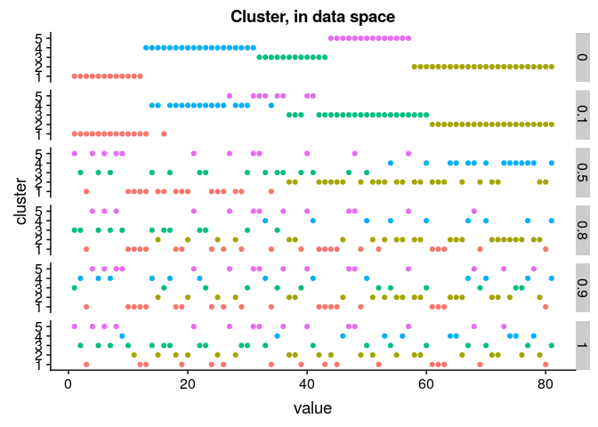
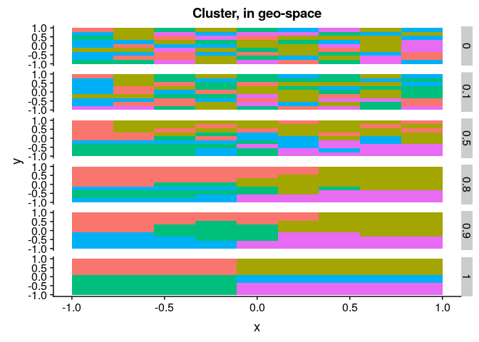
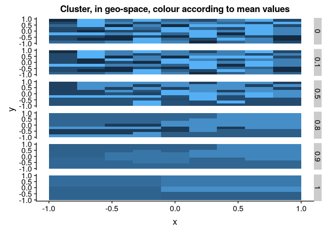
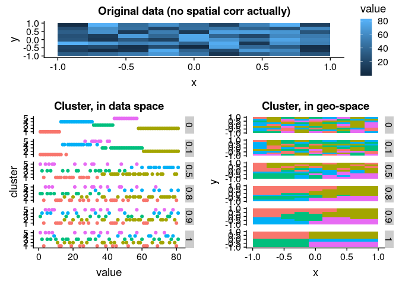

-   [Intro](#intro)
-   [Functions: prep data, compute clustering for various
    alpha](#functions-prep-data-compute-clustering-for-various-alpha)
    -   [Pseudo data](#pseudo-data)
    -   [Warm-up: some convenience
        functions](#warm-up-some-convenience-functions)
    -   [Compute distances](#compute-distances)
    -   [Use function on grid of
        alphas](#use-function-on-grid-of-alphas)
-   [Result: Visualisation](#result-visualisation)
    -   [Various plots](#various-plots)
    -   [Final result: compare data- versus
        spatial-clustering](#final-result-compare-data--versus-spatial-clustering)

    library(raster)
    library(tidyverse)
    library(ClustGeo)
    library(cowplot)

Intro
-----

I want to identify parts in a field with lower yields, and want these
parts to be contiguous. In spatial word, I am trying to do a 1D
clustering, taking into account the spatial distribution of the data. I
use here R package `ClustGeo` provides function `hclustgeo()` that does
a mixing of data and spatial distance doing *Ward-like hierarchical
clustering algorithm including soft contiguity constraints.*

`ClustGeo` has a parameter *α*, that indicates how much we want to
emphasize *data-clustering* versus *spatial-clustering*

-   *α* = 0: only data clustering
-   *α* &gt; 0 also give weight to saptial-clustering

Here, I give an example with a field with **random values** (zero
spatial correlation). Under random (non-spatial) sampling I expect:

-   data: with increasing *α*, means of cluster should become less and
    less different
-   spatial: with increasing *α*, cluster should get closer to... a
    square probably (that's the form with the lowest average difference,
    correct?)

Functions: prep data, compute clustering for various alpha
----------------------------------------------------------

### Pseudo data

    r <- raster(nrows = 9, ncols = 9, xmn=-1, xmx=1, ymn=-1, ymx=1)
    r[] <-  sample(1:81, size = 81, replace = FALSE)
    plot(r)

Convert to simple data

    ras_dat <- as.data.frame(r, xy = TRUE) %>%  as_tibble %>% 
      mutate(n_cell = 1:ncell(r)) %>% 
      select(n_cell, everything()) %>% 
      rename(value = layer)
    ras_dat

    ## # A tibble: 81 x 4
    ##    n_cell      x     y value
    ##     <int>  <dbl> <dbl> <int>
    ##  1      1 -0.889 0.889     3
    ##  2      2 -0.667 0.889    80
    ##  3      3 -0.444 0.889    43
    ##  4      4 -0.222 0.889    62
    ##  5      5  0     0.889    42
    ##  6      6  0.222 0.889    18
    ##  7      7  0.444 0.889    55
    ##  8      8  0.667 0.889    79
    ##  9      9  0.889 0.889    15
    ## 10     10 -0.889 0.667    24
    ## # ... with 71 more rows

### Warm-up: some convenience functions

Just make a distance function, and a nicer (data\_frame) output for the
`hclustgeo()` function.

    dist_rast_euclid <-  function(x)  {
      x %>% 
        xyFromCell(cell = 1:ncell(.))  %>% 
        dist() 
    }
    hclustgeo_df <-  function(D0, D1 = NULL, alpha, n_obs = TRUE, k = 5) {
      res <- hclustgeo(D0, D1, alpha = alpha) %>% 
        cutree(k=k) %>% 
        data_frame(cluster = .)
      if(n_obs) res <-  res %>% 
          mutate(n_obs =   1:nrow(.)) %>% 
          select(n_obs, everything())
      res
      
    }

### Compute distances

    dat_dist <- dist(getValues(r$layer))
    geo_dist <-  dist_rast_euclid(r)

### Use function on grid of alphas

I use alphas from 0 to 1, by 0.1.

    res_alphas <- data_frame(alpha = seq(0, 1, by = 0.1)) %>% 
      mutate(alpha_name = paste("alpha", alpha, sep="_"),
             data = map(alpha, ~ hclustgeo_df(dat_dist, geo_dist, alpha = ., k=5)))

    res_alphas_l <-  res_alphas %>% 
      unnest(data) %>% 
      left_join(ras_dat, by = c("n_obs" = "n_cell")) %>% 
      mutate_at(c("alpha", "cluster"), as.factor) %>% 
      group_by(alpha, cluster) %>% 
      mutate(cluster_mean = mean(value)) %>% 
      ungroup()

Result: Visualisation
---------------------

    res_alphas_l_dat <-  res_alphas_l %>% 
      filter(alpha %in% c(0, 0.1, 0.5, 0.8, 0.9, 1)) 

### Various plots

    ## show original
    pl_dat_orig <- res_alphas_l_dat %>% 
      filter(alpha ==0) %>% 
      ggplot(aes(x = x, y= y, fill = value)) +
      geom_tile() +
      ggtitle("Original data (no spatial corr actually)")

    ## show clustering in dat space
    pl_clus_datSpace <- res_alphas_l_dat %>% 
      ggplot(aes(x = value, y= cluster, colour = cluster)) +
      geom_point() +
      facet_grid(alpha ~ .) +
      theme(legend.position = "none") +
      ggtitle("Cluster, in data space")

    pl_clus_datSpace

    ## show clustering in geo space
    pl_clus_geoSpace <- res_alphas_l_dat %>% 
      ggplot(aes(x = x, y= y, fill = factor(cluster))) +
      geom_tile() +
      facet_grid(alpha ~ .) +
      theme(legend.position = "none") +
      ggtitle("Cluster, in geo-space")

    pl_clus_geoSpace

#### Show means

    pl_clus_geoSpace_means <- res_alphas_l_dat %>% 
      ggplot(aes(x = x, y= y, fill = cluster_mean)) +
      geom_tile() +
      facet_grid(alpha ~ .) +
      theme(legend.position = "none") +
      ggtitle("Cluster, in geo-space, colour according to mean values")

    pl_clus_geoSpace_means

yes indeed, as I expected, spatially-clustering random points reduces
variability between cluster means!

### Final result: compare data- versus spatial-clustering

PLug together in one (pkg `cowplot`):

    plot_grid(pl_dat_orig, plot_grid(pl_clus_datSpace, pl_clus_geoSpace), nrow = 2, rel_heights = c(1, 2))

